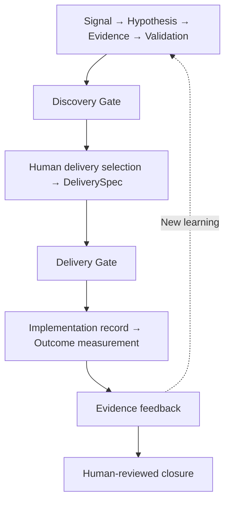

# Product Discovery Engine

An evidence-driven product decision system that turns messy product signals into
traceable learning, accountable delivery decisions and measured outcomes.

[](pyproject.toml)
[](https://github.com/steffueueue/product-discovery-engine/actions/workflows/ci.yml)
[](LICENSE)

Product teams decide from customer signals, interviews, analytics, stakeholder input,
assumptions, strategy and increasingly AI-generated interpretation. As inputs become
shipped work, uncertainty can harden into false certainty and decision rationale can
disappear. This system preserves what is known, what is assumed, who decided, and what
happened afterward.

**AI interprets. Deterministic code governs. Humans own decisions.**



The v0.1 lifecycle is complete in a Python modular monolith. People supply implementation
and outcome records; execution and analytics collection remain external. Closure ends a
reviewed episode while new evidence informs discovery.

## Three authority layers

| Layer | Responsibility |
| --- | --- |
| **AI** | Interpret signals, expose competing explanations through Challenge Mode, and draft specification proposals. |
| **Deterministic system** | Assess evidence quality/freshness, learning priority and readiness; enforce gates, lifecycle rules, version integrity and target comparison. |
| **Humans** | Select delivery work, accept or reject proposals, review knowledge and specifications, record explicitly supported overrides, interpret causality and authorize final closure. |

AI output remains advisory. Human acceptance retains its origin and review history.
See [authority boundaries](docs/architecture/authority-boundaries.md) for concrete examples.

## What makes it different

- **Unknown is valid.** Missing information stays visible instead of becoming invented certainty.
- **Contradictions survive.** More supporting evidence cannot cancel a material contradiction.
- **Learning priority and delivery readiness are separate.** An important unanswered question can deserve attention while delivery remains blocked.
- **Gate pass is not a build recommendation.** Delivery selection and implementation handoff require explicit human decisions.
- **A proposal is not a specification.** AI wording becomes authoritative only through review and human materialization.
- **Target achievement is not causal proof.** Failed, mixed and inconclusive outcomes return as evidence rather than disappearing.

## The search relevance case

Customers struggle to find relevant products. The working hypothesis is that relevance
contributes to discovery friction; the stronger claim that it is the principal cause of
abandonment is an assumption. Bounded evidence supports the problem, while price remains
a competing explanation.

High-impact uncertainty drives a targeted comparison. Its synthetic result contradicts
the stronger causal assumption. Human review keeps that contradiction and reframes the
candidate around the observed problem. The Discovery Gate can then pass without endorsing
a particular search technology.

A human selects bounded catalogue-search work and supplies a DeliverySpec: a versioned
delivery specification. Missing interface details block handoff until an owned clarification
produces a new version, human review of that version and a Delivery Gate pass.
Optional AI drafting uses a separate proposal/review path; the primary end-to-end example
uses human-authored specification content.

The implementation record retains a scope reduction to signed-in catalogue users and
leaves actual production exposure unverified. The measured synthetic results are:

| Metric | Baseline → observation | Target evaluation |
| --- | --- | --- |
| Search success | 60% → 74% | Met the ≥70% target |
| Abandonment | 30% → 30% | Did not meet the reduction target |
| p95 search latency | 180 ms → 290 ms | Exceeded the ≤250 ms guardrail |

**MIXED outcome; causality unresolved.** Three evidence items feed back into discovery.
A human records limitations, links follow-up learning and closes the reviewed episode.
All data and actors in this example are synthetic.

Read the [portfolio walkthrough](docs/portfolio-walkthrough.md) for the full story.

## Quickstart

Requires **Python 3.12+**. From a clone of this repository:

```sh
python3 -m venv .venv
.venv/bin/python -m pip install -e '.[dev]'
env -u OPENAI_API_KEY -u DISCOVERY_ANALYSIS_MODEL RUN_LIVE_AI_EVALS=0 .venv/bin/python examples/outcome_feedback.py
```

**No API key is required for the deterministic core or offline examples.** The representative
demo is the fastest way to understand the complete lifecycle. It uses hand-authored inputs
and an offline Challenge Mode provider, then prints scope deviation, target results, MIXED
assessment, unresolved causality and evidence feedback.

The [full credential-free suite](#full-verification) is optional for first-time exploration.

Live model evaluation is optional, separately authorized and currently deferred; offline
contracts do not establish live semantic quality. See [evaluation documentation](docs/evals/README.md).
For offline specification proposal review, run
`.venv/bin/python examples/delivery_specification.py`.

## Where to look

| Reader | Suggested route |
| --- | --- |
| Product leader / hiring manager / TPM | This README → [portfolio walkthrough](docs/portfolio-walkthrough.md) → [visual architecture](docs/architecture/portfolio-architecture.md) → [authority boundaries](docs/architecture/authority-boundaries.md). |
| Technical reviewer | [Architecture overview](docs/architecture/overview.md) → [visual architecture](docs/architecture/portfolio-architecture.md) → [ADRs](docs/README.md#architectural-decisions). Start with [discovery gating](src/product_discovery_engine/domain/discovery_gate.py) and [outcome orchestration](src/product_discovery_engine/application/outcome_feedback.py). |
| AI reviewer | [Provider boundary](src/product_discovery_engine/application/discovery_analysis.py) → [versioned prompts](src/product_discovery_engine/ai/prompts.py) → [offline evals](tests/evals/README.md) → [deferred live verification](docs/evals/deferred-live-verification.md). |

**Deep product reference / source of truth:** the [full product specification](docs/product-specs/discovery-prioritization-system-v0.1.md).
The [documentation index](docs/README.md) connects capability details, decisions and history.

## Engineering quality

Strict mypy, Ruff lint/format checks and credential-free tests run in
[CI](.github/workflows/ci.yml). Immutable, versioned domain records preserve full snapshots
and matching audits; tests enforce architecture boundaries and reject stale or mismatched
workflow inputs. The domain has no provider, storage, UI or HTTP dependencies.

The [v0.1 verification summary](docs/releases/v0.1.0.md#offline-verification) records
**1,099 credential-free tests passed** and **18 live AI checks intentionally skipped/deferred**.
Live model semantics remain unverified.

### Full verification

The full suite may take several minutes because of deep immutable snapshot validation.

```sh
env -u OPENAI_API_KEY -u DISCOVERY_ANALYSIS_MODEL RUN_LIVE_AI_EVALS=0 .venv/bin/python -m pytest
.venv/bin/ruff check .
.venv/bin/ruff format --check .
.venv/bin/mypy src tests
```

For reproducible development, install `requirements-dev.lock`, then install the project
with `.venv/bin/python -m pip install --no-deps --no-build-isolation -e .`.
Use `.venv/bin/ruff format .` to format and
`.venv/bin/python -m pip wheel . --no-deps --wheel-dir dist` to build a wheel.

## What v0.1 is not

There is no production database, RBAC/authenticated actors, web UI, external analytics
connector or automated deployment. Callers supply current records and retain full history;
production transactions and concurrency protection remain future work. Live model
verification is deferred. Semantic adequacy, source truth and causal interpretation still
require accountable human judgment.

## Development approach

This project was developed using a spec-driven, AI-assisted engineering workflow.
Product architecture, invariants, policy boundaries, acceptance criteria and evaluation
contracts were defined before implementation. Coding agents implemented against those
constraints; each functional increment was reviewed and verified before merge.

## Development history and release

[Development history](docs/history/development-history.md) preserves Milestones 0–7,
original repository narratives and historical reviews.
See the [v0.1.0 release-note draft](docs/releases/v0.1.0.md),
[repository metadata recommendations](docs/repository-metadata.md) and [MIT license](LICENSE).
