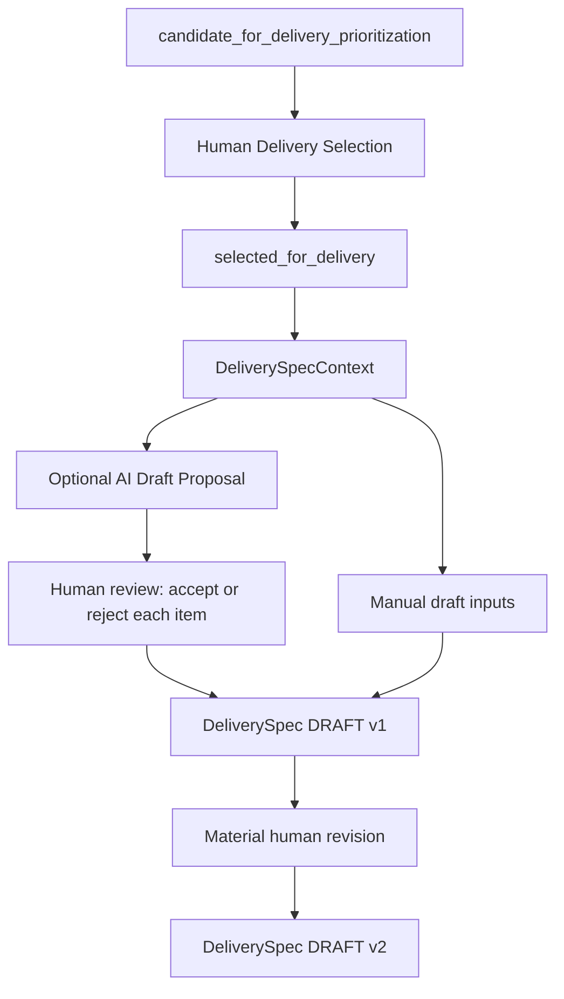

# Milestone 5: Delivery Selection and Specification Drafting

A Discovery Gate PASS answers whether a discovery snapshot may be considered for delivery
prioritization. It is not a build recommendation. Delivery Selection records a different,
accountable human product decision. A DeliverySpec then describes proposed delivery work;
its existence does not authorize implementation.

Every arrow represents an explicit operation. Gate evaluation, candidacy promotion,
selection, proposal generation, review and materialization remain separate operations.

## Domain and application boundaries

| Module | Responsibility |
| --- | --- |
| `domain/delivery_selection.py` | Immutable accountable selection, exact candidacy binding, lifecycle/decision audits |
| `domain/delivery_context.py` | Explicit selected snapshot, retained discovery inputs, human delivery context and closed source registry |
| `domain/spec_items.py` | Typed statements, structured criteria, origins and deterministic grounding checks |
| `domain/spec_proposals.py` | AI proposal record, actual provider provenance, complete human item dispositions and audits |
| `domain/delivery_specification.py` | Authoritative DRAFT snapshots, material revisions and reconstructable supersession |
| `application/delivery_specification.py` | Focused selection/context/draft/review/create/revise orchestration and provider protocol |
| `ai/specification_prompts.py` | Versioned supplied-context-only interpretation instructions |
| `infrastructure/openai_specification.py` | Optional Responses structured-output adapter using existing configuration |

The domain performs no I/O and imports no provider SDK or application models. Domain
proposal records describe immutable artifacts, not an AI agent or execution authority.
No portfolio ranking, RICE, WSJF, ROI, automatic comparison, top-N selection or allocation
is introduced. The optional provider cannot select work, change evidence, accept items,
create authoritative specs, mark completeness or authorize implementation.

## Human selection

`DeliverySpecificationService.select(current, candidacy, actor=..., rationale=..., at=...)`
requires the exact `CandidatePromotion.after` snapshot and
`candidate_for_delivery_prioritization`. A changed ID, content, version, links or status
fails. A dedicated `DeliverySelection` retains:

- Selection ID, full before/after hypothesis snapshots and exact hypothesis versions.
- Full candidacy record, its original gate/policies/override and discovery decision audit.
- Source/result status, accountable HUMAN actor/owner, nonempty rationale and aware time.
- Strategy reference and strategy context through the retained hypothesis/readiness inputs.
- Optional human decision context and distinct lifecycle and selection audit events.

Only status, version and update time change. Repeated selection, other source states,
absent actor/rationale and backward time fail. The generic `transition_hypothesis` and
`HypothesisChange` reconstruction reject `selected_for_delivery`, just as they reject
unqualified candidacy. Discovery Gate PASS alone leaves the snapshot unchanged.

Selection consumes established candidacy history, not a new gate evaluation. The gate
was current when candidacy was promoted; its original expiration remains historical.
Selection is a human decision, not an AI-generated record. A materially revised candidate
needs a newly established candidacy record; the service does not silently infer one.

## Explicit allowed context

`DeliverySpecContext` retains the exact selected snapshot and full selection. Its nested
candidacy retains accepted readiness knowledge, all supporting and contradictory evidence,
reviewed assumption state/risk/treatments, validation snapshots/results, Discovery Gate,
human Challenge Mode dispositions and versioned strategy. Accepted claim snapshots are
explicit caller inputs and must use this hypothesis's linked IDs and supplied evidence.
Omitted claim snapshots do not become available citations merely because an ID is linked.

`ContextFact` adds focused human assertions: delivery decisions, business/technical
constraints, existing-system facts or source artifacts. Each has an immutable ID,
hypothesis binding, actual source artifact reference, accountable recorder, timestamp and
rationale. Context assembly records an audit retaining every supplied fact ID. There is
no source fetching or external-context invention. Constraints can also be recorded as
selection decision context, but spec citations require the explicit typed context fact.

The source registry is derived from these retained objects, never a provider-supplied
allowlist. `SpecReference` carries kind, ID, optional version and optional material field.
Hypothesis citations include the exact selected version and field. Provider references
must match the registry exactly, including version/field; unrelated, invented or omitted
objects cannot silently become grounded references.

## Typed content and provenance

`SpecItemType` covers title, summary, problem, segment, outcome, scope, non-goals, solution,
functional requirements, business rules, acceptance criteria, quality requirements,
interfaces, data, analytics, dependencies, constraints, risks and open questions.
`SpecItem` has a stable item ID, typed kind, statement, explicit origin and source refs.
`AcceptanceCriterion` supports structured given/when/then as individual `SpecStatement`
clauses, each carrying its own origin/references and able to remain explicitly unknown.
Source-backed, human-decided, proposed and unknown clauses may coexist without flattening
their provenance. Sections may have multiple items or no items; no generic content
mapping or mandatory completeness rubric is used. Quality/privacy/security/accessibility
considerations can be represented without inventing thresholds or compliance obligations.

| Origin | Meaning | Acceptance preserves |
| --- | --- | --- |
| SOURCE_BACKED | Exact restatement of supplied knowledge, solution intent, constraint or system fact | Exact source and original scope |
| HUMAN_DECISION | Exact explicit supplied human product/technical decision | Human decision origin, recorder and rationale |
| AI_PROPOSAL | Generated proposal rather than established knowledge | AI origin plus provider record and human disposition |
| UNKNOWN | A typed `Unknown(reason=...)`, never a fabricated value | Explicit uncertainty and any relevant refs |

All material wording is an item with provenance. A generated source restatement still
has an AI-generated proposal record, even when its epistemic content remains source-backed.
AI may organize an existing human decision, but cannot create a new decision by assigning
that origin: the exact statement and human reference must already exist in context.
Human decision references cannot be relabeled source-backed to conceal decision origin.
Human acceptance of AI_PROPOSAL never changes it to SOURCE_BACKED. A genuinely new human
requirement uses an explicit human context decision and a new item identity.

Grounding is intentionally conservative: source-backed statements must exactly restate a
supplied source. Paraphrases remain proposals or explicit human decisions. Solution-facing
items (scope, requirements, criteria, interfaces, data, analytics, constraints/dependencies)
need an explicit solution field, constraint, system fact or human decision. Discovery
observations, strategy aspirations and gate/readiness results do not establish those items.
Thus “users reformulate queries” cannot establish “use vector embeddings”, and even exact
restatement of an observation cannot relabel it a functional requirement.

Generated free-text concrete numbers are rejected in v1; numeric wording belongs in exact
sourced or explicit human-decision content. This deliberately includes numeric identifiers
such as OAuth2, which should be sourced rather than invented. Endpoint-like paths/HTTP
operations in AI solution-facing proposals (including criterion clauses) are rejected. Missing endpoints, latency values,
retention rules and solution hypotheses stay unknown. A solution item cannot be generated
as a new proposal without supplied solution intent. Nonnumeric proposed quality/analytics
considerations and criteria may remain explicitly proposals until human review.

These guards are bounded lexical/structural checks, not a general semantic classifier.
Spelled-out numbers, indirect unsupported implications and natural-language API descriptions
still require accountable human review. Source-backed is a restatement classification,
not independent verification of source authenticity or truth.

## Proposal generation, human review and materialization

`SpecificationDraftingProvider.draft_specification(context)` returns a schema-validated
`DeliverySpecDraftProposal` with the exact context ID and explicit `ai_generated=True`.
The application retains it in `SpecProposalRecord`, with full input, provider/model/prompt
version, generation time and AI generation audit. Nested models and context/reference
checks are revalidated, including unchecked model copies. Provider errors are sanitized.

`service.review(record, dispositions, actor=..., at=...)` requires a human actor and one
accepted/rejected disposition plus nonempty rationale for every item. It returns a full
`SpecProposalReview` with review and individual acceptance/rejection audits. Rejected
wording remains in the proposal; it is absent from authoritative draft content.

`service.create(context, manual_items=..., reviews=..., actor=..., at=...)` is a separate
human operation. New proposals must bind the exact materialization context; prior reviews
retain their historical input contexts during revisions. AI content must exactly match an accepted item in a retained review for
the same selection. Proposal acceptance does not itself create a spec. Manual source-backed,
human-decision and unknown drafts work without configuring a provider. An empty or otherwise
incomplete draft is valid. Creating a draft does not rewrite the discovery hypothesis,
evidence, assumptions, claims or candidacy.

The optional OpenAI adapter uses `OpenAIAnalysisConfig`, preserving `OPENAI_API_KEY` and
`DISCOVERY_ANALYSIS_MODEL` conventions. It uses Responses `responses.parse`, strict schema,
`store=False`, 60-second timeout and two SDK transient retries. Refused/incomplete/invalid
output fails; no prompt contains the authoritative acceptance algorithm. Neither service
construction nor ordinary tests call OpenAI. Normal development needs no credentials.

## Immutable versions, history and audits

A `DeliverySpec` retains ID, positive integer version, schema version, typed DRAFT status,
exact hypothesis/selection binding through its full context, typed items, all reviewed
proposal records, original creation actor/time, predecessor reference and last material
revision actor/time/reason/changed item IDs. Convenience properties expose hypothesis ID,
hypothesis version and selection ID without duplicating inconsistent fields.

`service.revise(before, context, items, actor=..., at=..., reason=..., reviews=...)` produces
v+1. No-op revisions, missing actors/reasons, backward time, other selections or inconsistent
history fail. Prior accepted/rejected proposal history and explicit human facts remain
retained. Existing item identities are immutable: rewording/reclassification replaces an
item with a new ID; changed IDs deterministically identify additions/removals. A new
context may add explicit human decisions without rewriting discovery history.

`DeliverySpecChange` retains full before/after versions and reconstructs creation/revision,
item acceptance/human requirement or constraint additions and supersession audits. Supersession records
link old/new versions; the old DRAFT snapshot is not mutated to SUPERSEDED. Retain every
change, context, proposal and review to reconstruct history. These records are not storage,
event sourcing or a unique-ID registry. Removing accepted content in a later revision
preserves its old snapshot and review, not a retroactive rejection of the original decision.

Future enum values exist for compatibility, but all non-DRAFT authoritative statuses are
rejected by Milestone 5 constructors. No completeness-driven transition is implemented.
Existing later hypothesis stage enums remain historical foundations, not a new delivery
implementation workflow or authorization.

## Offline verification and example

Run `python examples/delivery_specification.py` in the installed environment. The synthetic
search scenario reaches candidacy, separately records human selection, retains its discovery
history, generates a fake proposal, rejects unsupported embeddings, preserves problem/outcome
sources and solution/interface/latency unknowns, creates DRAFT v1 and adds a human non-goal
in v2 while v1 stays intact. It stops there.

Selection/spec tests cover preconditions, exact binding, no generic bypass, actor/rationale,
immutability, JSON reconstruction/tampering, origins, unknowns, references, numeric/interface
invention, human review, revisions, supersession and unavailable future statuses.
Ten hand-authored golden cases A–J cover problem-only/explicit solution, unsupported numbers,
unknown interface, evidence-to-solution leap, constraint, contradictory evidence, invented
reference, acceptance criterion and human decision. Real SDK tests use local httpx mock
transport for valid/invalid/refused/incomplete/auth/rate-limit responses. They verify the
adapter contract without accessing the network; fixtures are not live-model semantic passes.

## Limits, risks and deferred scope

- No persistence, transactions, atomic current-version comparison, role authorization or
  latest-state lookup. Callers must supply the actual current hypothesis and retain full
  records. Competing callers can branch history; future storage must prevent duplicates
  and stale revisions atomically. No model can detect withheld current evidence changes.
- Human source classifications/decisions and reviewed claims are accountable assertions.
  Lexical guards and exact restatements do not certify semantic entailment, source truth,
  scope adequacy, completeness, policy/legal compliance or a correct build decision.
- Full nested records duplicate context and may grow large; source text may be sensitive.
  No context-size budgeting, redaction or production retention/access system exists.
  `store=False` does not define the provider's complete retention policy.
- Synchronous provider API, no portfolio ordering, persistence backend, deployment UI,
  implementation/code-generation execution, production deployment, outcome measurement
  or feedback loop. There are no new dependencies or opt-out removals of existing live tests.
- Paid live verification is intentionally deferred. The checklist adds grounded drafting,
  hallucination/unknown preservation, numeric/reference safeguards, solution-leap prevention
  and criterion quality for a later explicitly authorized phase; no semantic pass is claimed.
- **Milestone 6 remains deferred:** automatic completeness scoring/gate; blocking/nonblocking
  gap classification; targeted clarification questions and ownership; question/answer
  resolution lifecycle; completeness-driven NEEDS_CLARIFICATION/READY_FOR_REVIEW behavior;
  READY_FOR_DELIVERY; Delivery Gate; implementation authorization.
