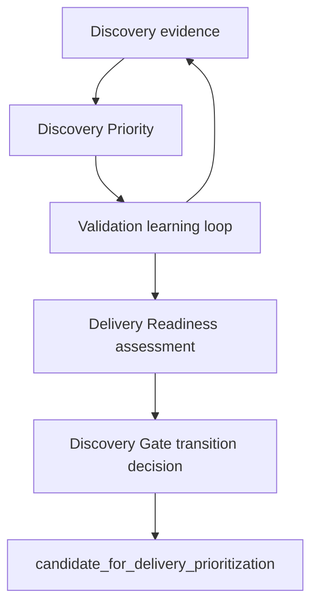

# Milestone 4: discovery decisioning

Milestone 4 adds three deterministic capabilities to the modular monolith. It ends at
`candidate_for_delivery_prioritization`. No new AI behavior, paid calls, dependency,
storage backend, UI, portfolio ranking or delivery selection is introduced.

| Capability | Question | Output | Authority |
| --- | --- | --- | --- |
| Discovery Priority | What should we learn next? | Ordinal learning category, action, blockers and ties | Explicit impact/uncertainty policy |
| Delivery Readiness | How mature and defensible is this knowledge? | Dimension results, gaps/concerns, qualitative state | Configured knowledge requirements |
| Discovery Gate | May this snapshot move toward delivery prioritization? | Passed/failed/unknown/review conditions | Versioned conditions plus snapshot/time invariants |

High learning priority can coexist with low readiness. Readiness does not rank an
initiative. A gate pass authorizes consideration, never building or delivery selection.
There is no composite numeric product score, decimal confidence or probability.



Priority is iterative and may be recomputed many times. Readiness is an assessment,
and the gate controls a distinct transition. The arrows do not imply automatic actions.

## Boundaries and entry points

- `domain/decisioning_policy.py`: typed policy bundle and configuration safeguards.
- `domain/discovery_priority.py`: explicit learning inputs, results and category groups.
- `domain/decisioning_inputs.py`: exact-scope evidence packets and human review inputs.
- `domain/delivery_readiness.py`: pure dimension evaluation and immutable assessments.
- `domain/discovery_gate.py`: pure condition evaluation, immutable gates and overrides.
- `domain/discovery_promotion.py`: candidacy authority and before/after/audit consistency.
- `application/discovery_decisioning.py`: service coordination, Milestone 3 knowledge
  translation, actual Challenge Mode record checks and explicit promotion operation.
- `infrastructure/configuration.py`: TOML I/O followed by independent domain validation.

The domain imports only itself, standard-library non-I/O modules and Pydantic. It does
not import application knowledge or advisory models. `decision_knowledge` translates
existing `KnowledgeState` without inventing classifications; it retains evidence,
reviewer basis, quality/freshness records, provenance groups and complete evidence policy.
The packet reconstructs Milestone 3 quality, freshness and triangulation on validation.
Reviewed assumptions retain their risk policy and reconstruct its ordinal result.

Models are deeply immutable and revalidate nested instances, including deserialization.
Every decision record retains full deterministic inputs, policy snapshot, policy version,
time, result and audit. Result validators recompute the decision, rejecting mismatched
results, audits and unchecked nested copies. No mutable policy registry or hidden state
participates in a decision. Callers own retention and transactions.

## Discovery Priority v1

The highest matching explicit rule determines the underlying category:

| Minimum decision impact | Minimum unresolved uncertainty | Category |
| --- | --- | --- |
| VERY_HIGH | HIGH | CRITICAL |
| HIGH | MEDIUM | HIGH |
| MEDIUM | MEDIUM | MEDIUM |
| VERY_LOW | VERY_LOW | LOW |

Known uncertainty at most LOW with no open gap, active contradiction, freshness concern,
refutation or inconclusive learning produces NO_ACTION. Missing impact or uncertainty
produces UNKNOWN. Unknown planning values remain `None` and are retained; they are never
cheap/fast/high-information defaults. Assumption risk is exposed separately from the
category; impact and uncertainty control decision relevance directly.

`LearningInput` retains the hypothesis, target identity/kind/description, optional
assumption/risk snapshot, uncertainty, evidence gaps, contradictory evidence references,
freshness concerns, information gain, cost, speed, validation snapshots, chosen proposal,
dependency completion references and blockers. When a validation proposal is referenced,
its gain/cost/speed must match that snapshot. Existing validation references cannot be
silently treated as absent: incomplete context remains visible and is not actionable.

READY/RUNNING validation or an IN_PROGRESS assumption produces a monitor action and
NO_ACTION for a duplicate next test; the underlying priority is preserved. Blocked
learning keeps its category and blockers with an UNBLOCK action. Completed historical
activities do not create false pending dependencies. Inconclusive results may retain
high priority. Refutation or active contradiction suggests REFRAME, preserving competing
explanations instead of seeking repeated confirmation. Invalidated historical contradiction
references are retained without being treated as active directional support.

Information gain, cost and speed inform accountable test planning; v1 deliberately does
not let them break a category tie or demote critical expensive learning. `priority_ties`
groups only targets from the same hypothesis snapshot and policy. Within-category order
is presentation order, with no winner or rank. UNKNOWN targets are returned separately
from the ordinal groups. This operation cannot rank hypotheses across a portfolio.

## Delivery Readiness v1

Overall states are NOT_READY, NEEDS_REVIEW and READY. Dimensions are UNKNOWN,
INSUFFICIENT, PARTIAL, SUFFICIENT or NOT_APPLICABLE. A required UNKNOWN/INSUFFICIENT
blocks readiness; a required PARTIAL requires review; only sufficient or applicable
exemptions permit READY. Optional uncertainty is a non-blocking concern.

The initial policy requires problem evidence, segment understanding, outcome clarity,
quality, freshness, triangulation, assumption risk, contradictions, validation, Challenge
Mode, ownership, strategy and conditional solution effectiveness. It evaluates reach,
viability, causal mechanism and business impact separately as optional dimensions. These
remain UNKNOWN without their own evidence. A future authorized policy can require them;
problem support can never satisfy them. READY under v1 does not establish population
prevalence, causal truth, economic impact or viability.

| Evidence dimension | Exact target | Minimum quality | Independent groups/methods |
| --- | --- | --- | --- |
| Problem evidence | problem_existence | MEDIUM | 2 / 2 |
| Target segment | target_segment | MEDIUM | 1 / 1 |
| Reach | reach | MEDIUM | 2 / 2 |
| Viability | viability | MEDIUM | 2 / 2 |
| Causal mechanism | causal_mechanism | MEDIUM | 2 / 2 |
| Business impact | business_impact | MEDIUM | 2 / 2 |
| Solution effectiveness | solution | MEDIUM | 2 / 2, only when a solution exists |

Each target requires an explicit hypothesis/claim-or-assumption/population scope.
Readiness does not choose the most convenient claim or merge populations. Missing scope,
missing population or no evidence remains UNKNOWN. Named problem/segment/outcome content
must also be available. A problem-only hypothesis with `solution_hypothesis=None` gets
NOT_APPLICABLE for solution effectiveness. An explicit Unknown solution remains UNKNOWN.

Only scope-matching supporting evidence meeting the quality and freshness requirement
can establish that claim's support. Contradictions are assessed separately and remain
visible; support counts cannot outweigh them. Quality remains the Milestone 3 weakest
ordinal dimension; evidence count gives no quality bonus. Nonrepresentative interviews
cannot satisfy representative reach just because many people were interviewed.

Freshness states come from the retained Milestone 3 policy and reviewer context. CURRENT
receives normal evaluation; REVIEW_DUE requires review for applicable v1 claims; STALE
does not satisfy current v1 support; INVALIDATED never qualifies. Historical evidence is
retained in the input and dimension history, and freshness concerns identify its IDs.
Freshness and quality must reconstruct, and readiness requires freshness for its UTC day.
Invalidated validation dependencies never satisfy required validation; v1 additionally
requires current generated evidence for required/critical validations.

Independent support uses canonical origin families and provenance connected components,
not report count. Full-history overlap is retained even when a weak, stale, invalidated
or contradictory connecting record is filtered from qualifying support. Only methods
from qualifying support count, with a distinct method matched to a distinct source group.
Three reports from one dataset do not satisfy multiple-source/method requirements.

### Assumptions, validation and contradictions

Every linked assumption is inspected. Missing impact, uncertainty or risk assessment
stays UNKNOWN. HIGH-or-greater impact with HIGH-or-greater uncertainty is critical under
v1. A high-impact REFUTED assumption also needs treatment even if uncertainty is low.
Resolution or a policy-permitted human treatment tied to the exact risk assessment is
required. Low-impact unresolved uncertainty does not automatically block.

Explicitly required validations must be COMPLETED with retained, matching criteria-bound
results and valid generated-evidence dependencies. Critical assumptions also require at
least one defensible completed validation when configured. Later completed learning can
resolve earlier inconclusive learning; an explicitly required inconclusive activity still
requires review. This does not require every assumption or optional activity to be resolved.

Contradiction treatment is a human assertion for an exact scope and all active
contradictory references in it:

- missing classification: UNKNOWN;
- healthy mixed evidence: PARTIAL/review;
- unresolved material contradiction: INSUFFICIENT;
- invalidates a critical assumption: INSUFFICIENT;
- explicitly investigated and accepted: SUFFICIENT when policy permits acceptance.

Acceptance does not remove evidence or convert contradiction to support. Refuted
assumptions remain refuted. Treatments/reviews retain human actor, reason, timestamp and
material hypothesis version. A reviewer remains responsible for the semantic adequacy of
an acceptance; schema checks cannot prove that an investigation was sufficient.

### Challenge Mode, strategy and accountability

The application requires the actual retained `ChallengeRecord`, matching completion ID,
item references, current hypothesis statement and the exact scoped knowledge snapshot.
The readiness input retains completion references and human dispositions. All advisory
items must be addressed exactly once in a completed human review. Human-reviewed severity
is separate from AI severity. Serious unresolved human-reviewed challenges block; unknown
human severity blocks; unreviewed completion requires review. Explicit human acceptance
or an addressed challenge is distinguishable from an unresolved challenge. Low-severity
open concerns remain visible without automatically blocking. No LLM sets readiness.

Strategy context retains the existing `StrategyPolicy` with its versioned reference and
actual objective. A reference alone or an Unknown objective, including
`insufficient_strategy_context`, cannot satisfy readiness. V1 requires a human
acknowledgement of that exact strategy snapshot. AI strategic-fit interpretation is
never authoritative. Missing hypothesis owner stays UNKNOWN.

## Discovery Gate v1

Each gate retains the current lifecycle/hypothesis snapshot, readiness assessment and
reference, complete active policy bundle, timestamps/expiry, conditions and two audit
events. Conditions are PASSED, FAILED, UNKNOWN or REVIEW_REQUIRED. Overall results are
PASSED, BLOCKED or NEEDS_REVIEW. Any required UNKNOWN prevents ordinary PASS.

Configured conditions cover readiness, required targets, owner, freshness, quality,
triangulation, critical assumptions, validation, Challenge Mode, strategy and contradictions.
Technical prerequisites are mandatory invariants: exact snapshot, matching complete
readiness policy, applicable current assessment and an `evidence_updated` source state.
Missing readiness is an evaluable BLOCKED record with UNKNOWN conditions, not a boolean
or silently accepted omission. A policy name match alone cannot mask changed policy content.

A gate is usable for at most the configured 24 hours from readiness assessment and never
past the next UTC midnight, because freshness was evaluated for that day. Evaluating stale
readiness produces a blocked gate. Promotion revalidates the full retained gate and checks
expiry, complete active policies, actor and exact current hypothesis snapshot. A gate for A
cannot promote B, and changing material content, links, version or status invalidates it.

### Lifecycle integration and overrides

`DiscoveryDecisioningService.promote(current_hypothesis, gate, actor=..., at=...)` delegates
to the pure promotion operation. It returns `CandidatePromotion` with before/after
snapshots, retained gate, active policy, optional override, lifecycle event and decision
event. It only changes status to candidacy, increments version and updates time. An
accountable human must execute the operation. The generic `transition_hypothesis` and
ordinary `HypothesisChange` deserialization reject candidacy without this dedicated path.
The historical stage graph remains for reference; its edge alone is not authorization.
No new operation selects an initiative for delivery.

An override is a separate immutable `DiscoveryGateOverride`, never an ordinary PASSED
result. It retains the original full gate/result, actor, reason, time, policy version,
explicit `authorize_candidacy` action, overridden conditions and override audit. Only
HUMAN actors with ownership can override. V1 permits only known readiness, challenge and
contradiction concerns. Every unmet condition must be explicitly configured overridable;
UNKNOWN, technical prerequisites, stale gates and already-passed gates cannot be bypassed.
The separate promotion path must explicitly consume the override and use its same human
actor. The original gate remains BLOCKED/NEEDS_REVIEW, and promotion audits identify the
override. This is an audit foundation, not a role/permission system.

## Configuration and retained history

Load `config/discovery-decisioning.v1.toml` using `load_decisioning_policies`. Three small
policy models share a required bundle version. Validation rejects unknown dimensions,
invalid ordinals/targets, duplicate rules/requirements/conditions, incomplete priority
coverage, invalid method requirements, invalidated acceptable freshness, missing evidence
requirements, missing version, mismatched subpolicy versions, unsafe readiness criteria
and gate conditions without required readiness dimensions. It adds no generic rules engine.
Use a new version when business policy changes and retain the previous complete snapshot.

Audit events cover priority assessed, readiness assessed, gate evaluated, gate passed,
gate blocked, gate review required, gate overridden, candidacy promoted and its decision.
Human reviews are immutable inputs retained within audited assessments, not silent edits.
Retain before/after hypotheses, full decisions and reviews, policy bundles, knowledge/source
history, validation recordings and actual advisory records. Completion references alone
cannot reconstruct advisory prose. These records are not durable storage or event sourcing.

## Usage and offline example

```python
from product_discovery_engine.application.discovery_decisioning import DiscoveryDecisioningService
from product_discovery_engine.infrastructure.configuration import load_decisioning_policies

service = DiscoveryDecisioningService(load_decisioning_policies(policy_path))
priority = service.priority(learning_input, actor=reviewer, at=clock)
readiness = service.readiness(
    readiness_input, actor=reviewer, at=clock, challenge_record=retained_challenge_record
)
gate = service.gate(current_hypothesis, readiness, actor=reviewer, at=clock)
promotion = service.promote(current_hypothesis, gate, actor=reviewer, at=clock)
# Retain all returned records; handle BLOCKED/NEEDS_REVIEW before requesting promotion.
```

Run `.venv/bin/python examples/discovery_decisioning.py`. The synthetic example records
independent problem and segment evidence, identifies a critical relevance/price causal
assumption, initially blocks readiness/gating, completes a predefined controlled validation,
retains contradictory/refuted history, records human treatment and challenge/strategy
review, passes the gate and promotes problem-only candidacy. It uses hand-authored advisory
output through the existing provider boundary; it makes no network or paid AI calls.

## Known limitations and architectural risks

- Reviewer quality/impact/uncertainty, canonical origin identity and human treatments
  remain accountable assertions; deterministic consistency does not certify truth.
- V1 targets one explicit claim/population per readiness dimension, with conservative
  qualifying support and full-history source overlap. Mixed evidence needs human review.
  It is an initial policy, not a calibrated universal readiness standard.
- Information gain/cost/speed are planning context in v1; tied learning categories are
  intentionally unresolved. Hypothesis groups are not a portfolio ordering.
- Challenge Mode currently reviews one existing scoped knowledge record. Human review
  must consider the wider hypothesis; completion does not prove coverage of every risk.
  Retain the full external advisory record. Paid semantic verification remains deferred.
- No durable storage, transactions, role authorization, atomic compare-and-swap, unique
  event registry or latest-source lookup exists. Persist decision/audit records together
  and compare the current version atomically in a future repository boundary.
- Promotion sees the explicitly supplied hypothesis and gate, not hidden current evidence
  state. Evidence invalidation/review, new validation or review information after a gate
  must invalidate/reassess that decision at the future persistence/application boundary;
  do not reuse the old gate simply because the hypothesis's evidence ID list is unchanged.
  Expiry limits time, but cannot detect external changes the caller did not supply.
- Legacy unscoped evidence needs explicit Milestone 3 scope migration before readiness.
  Completeness checks reject dropping linked records rather than quietly assessing a subset.
- Existing later-state enums and historical transition foundations remain; Milestone 4
  adds no delivery-selection, specification, delivery-gate, implementation or outcome work.
