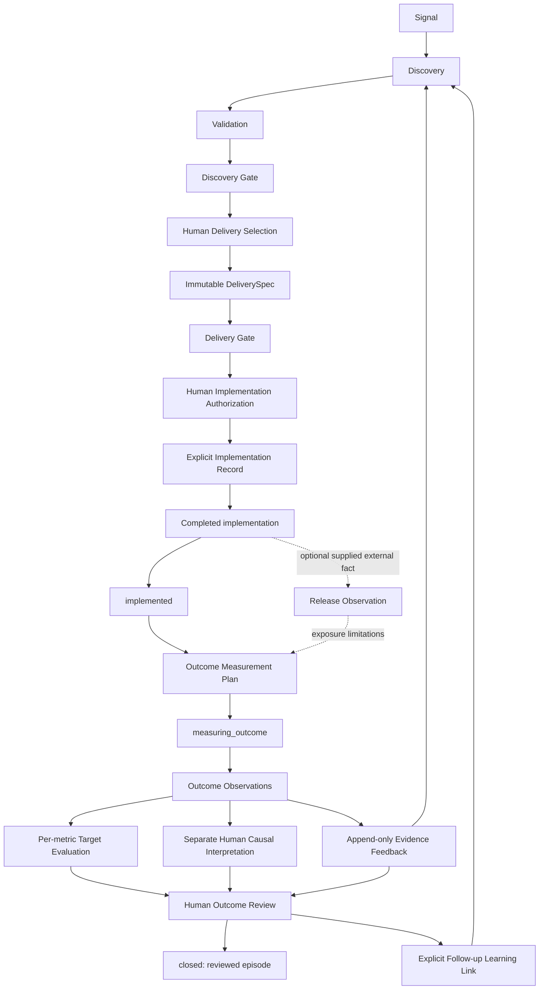

# Milestone 7: implementation outcome and feedback loop

Milestone 7 completes the v0.1 functional lifecycle in the existing Python modular
monolith. It records supplied external reality and reviewed learning; it executes no
implementation, release, analytics collection or follow-up action. Its public use cases
are `OutcomeFeedbackService`. Every core operation is deterministic and credential-free.



Each arrow that changes state is a separate explicit operation. Feedback is available
before final review so the reviewer sees the current knowledge. It can also be retained
as further learning after review; any material hypothesis/evidence version change makes
that previous review stale for closure. Closed never means proven true.

## Authority boundaries

| Concept | Statement it supports | What it cannot establish |
| --- | --- | --- |
| ImplementationAuthorization | A human permits handoff of this exact authorized spec/version | Work started or completed |
| ImplementationRecord IN_PROGRESS | Accountable owner reports work started at a supplied time | Completion or availability |
| ImplementationRecord COMPLETED | Human supplies actual delivered scope and structural accounting | Global deployment, exposure or product success |
| ReleaseObservation | A supplied external release fact identifies environment/audience/time/rollout | Valid analytics, target achievement or causality |
| OutcomeObservation | An immutable metric observation with source and method | A causal conclusion |
| OutcomeMetricEvaluation | A deterministic predefined-target comparison | Overall product success or implementation attribution |
| CausalInterpretation | A human reviews a claim against scoped evidence and design | Unsupported percentages or automatic causal proof |
| OutcomeReview / closed | An accountable person reviewed and closed this episode | The original hypothesis was correct |

## Modules and retained records

| Module | Responsibility |
| --- | --- |
| `domain/implementation.py` | Explicit status, exact authorization binding, delivery deviations, optional release facts |
| `domain/outcome_measurement.py` | Metric definitions, baseline observations, immutable plan versions and outcome observations |
| `domain/outcome_policy.py` | Typed versioned complete-window and inconclusive-closure policy |
| `domain/outcome_evaluation.py` | Recomputable comparisons and transparent qualitative assessment |
| `domain/outcome_causality.py` | Separate human interpretation using Milestone 3 scopes and quality concepts |
| `domain/outcome_feedback.py` | New Evidence, complete provenance and preserved before/after discovery history |
| `domain/outcome_review.py` | Human accountability, explicit follow-up recommendations and learning links |
| `domain/outcome_lifecycle.py` | Validated dedicated implementation/measurement/closure receipts |
| `domain/outcome_audit.py` | Matching human operation audits |
| `application/outcome_feedback.py` | Current-packet checks, IDs and focused record assembly |
| `infrastructure/configuration.py` | Outcome policy TOML loading |

All records inherit the existing frozen, extra-forbidding, nested-revalidating domain
model. Supported operations revalidate supplied instances, including unchecked copies.
There is no new AI provider, prompt, dependency, live case or decision agent. Original
Milestone 0–6 contracts and the deferred paid-verification checklist remain intact.

Callers must retain full records, previous snapshots, source artifacts, policy versions
and every audit together. IDs and event metadata alone cannot reconstruct a history.
Implementation records and plans retain their consecutive predecessors. Lifecycle receipts
retain the exact before/after hypothesis and consumed authorities. Reviews retain all
metric evaluations, causal interpretations and original plus feedback evidence.

## Implementation and structural comparison

Authorization is never automatically turned into a planned implementation. Humans may
explicitly plan work, then start it, or explicitly start it directly. The owner, start
actor/time and exact authorization are mandatory. Start compares the complete supplied
current DeliveryGateInput and active spec policy with the authorization, checks its
expiry and recomputes the still-valid delivery conditions. Wrong hypothesis, selection,
spec/version, workflow or policy fail. The original short-lived gate must still be valid
at start; later completion does not expire merely because the original handoff gate did.

Allowed implementation edges are PLANNED → IN_PROGRESS / CANCELLED and IN_PROGRESS →
COMPLETED / CANCELLED. Completed/cancelled records are terminal. Every snapshot carries
an operation audit. Completion requires actual delivered scope, actor/time and accounting
for every delivery-facing spec item: delivered item IDs or explicit omission deviations.
Unknown artifact and deployment information may remain absent.

Deviations explicitly identify omitted, changed, reduced, additional or interface-changed
behavior. All non-additional deviations target an item in the exact authorized spec.
Omitted items cannot simultaneously be delivered; changed/reduced items must be identified
as delivered. Added behavior has no original item ID. Each deviation has its own audit
and rationale. Deviations are descriptive, not automatically failures. Historical specs
are never revised to fit delivery reality.

Optional ReleaseObservation records retain the completed implementation, environment,
audience, released time, rollout description, version, underlying provenance, actor and
collection time. Release is an external attestation, not deployment execution. Plans may
retain these records; partial rollout and exposure limitations flow through metric results,
feedback methodology and the human review. The code does not infer global exposure.

## Measurement planning and hindsight

An OutcomeMeasurementPlan binds the exact implemented hypothesis snapshot and completed
implementation. Its desired-outcome reference explicitly identifies that hypothesis's
`desired_outcome` field/version, preserving unknown wording where applicable. Plans retain
owner, source definition, analysis method, window, confounders, interpretation risks,
creation time, immutable version and material change actor/time/reason.

Each OutcomeMetricDefinition includes ID, name, description, unit, improvement direction,
primary/secondary/guardrail role, population, aggregation/denominator, source, optional
cadence, baseline definition/period, outcome period, optional target and exact feedback
EvidenceScope. A metric name alone never defines conversion. Feedback claim/assumption
references must belong to the original discovery episode; populations match exactly.

BaselineObservation retains a value or explicit unknown reason, exact metric/implementation,
period, population, source, method, limitations, provenance, collection actor/time and audit.
Missing baselines are never manufactured. An absolute threshold can be evaluated without
a baseline, with the absence visible. Directional improvement needs comparable numeric
baseline and actual values. Baseline corrections use a new observation ID in a versioned
plan while its predecessor preserves the original observation.

Targets are explicit numeric comparator, threshold, inclusive range, directional or exact
qualitative-state definitions. `None` means no predefined target. Qualitative matching is
literal state matching, not semantic interpretation. Numeric precision, tolerances and
percent improvements are never inferred from prose. Nonfinite numbers and boolean numeric
substitutes are rejected. No target gives NOT_EVALUABLE, with actual observations retained.

Plans should precede observation windows. Initial late plans and revisions at/after either
the original or resulting metric window start are explicitly post-hoc; this marking cannot
be undone by moving a window forward. Revisions retain complete predecessor, human reason,
time and target audits. Observation and evaluation records keep the exact plan version
that was used; old observations are not silently reevaluated against a new target. A new
version does not rewrite older metric or baseline definitions. Callers supply complete
current history; withheld observations/changes cannot be discovered without persistence.

## Observation and target evaluation

An OutcomeObservation carries its full immutable plan snapshot, exact implementation and
metric, observed number/state or unknown reason, population, source, observation window,
collection time, methodology, limitations, provenance and audit. Its window must lie within
the metric's defined outcome period. Collection cannot precede measurement or its plan.
Unknowns remain observations of missing information, not invented measurements.

Evaluation retains the full plan (therefore metric/baseline/target/window), supplied actual
observations, policy/version, actor/time, state, explanation, limitations and missing
information. Its validator recomputes comparison. There is no implicit averaging across
observations or metrics, no weighted success formula and no unsupported tolerance.

| State | Deterministic meaning |
| --- | --- |
| MET | All supplied comparable full-period observations meet the explicit target |
| PARTIALLY_MET | Supplied comparable full-period observations disagree on meeting the target |
| NOT_MET | Comparable full-period observations do not meet the target |
| INCONCLUSIVE | Missing/unknown/incomparable data, incomplete configured window or partial-period observation |
| NOT_EVALUABLE | No predefined target |

Partial periods are not extrapolated to full periods. Multiple full-period observations
remain individually retained, and conflicting values produce a visible limitation.
Sampling sufficiency and instrument validity remain supplied methodology/limitations;
there is no statistical significance or sample-size estimator in this milestone.

OutcomeAssessment retains one evaluation for every plan metric in plan order and the
same policy. All MET gives POSITIVE, all NOT_MET gives NEGATIVE, only inconclusive or
unevaluable results gives INCONCLUSIVE, and any other combination gives MIXED. Every
metric's limitations and missing information remain exposed. This summary labels the
measurement pattern; it neither decides product success nor hides a guardrail regression.

## Causal review and feedback

Target achievement never sets causal state. CausalInterpretation separately retains claim,
exact causal/assumption EvidenceScope, implementation via plan, supporting/contradicting
evidence, existing quality assessments, study design, assignment/instrumentation/exposure
notes, known confounders, limitations, interpretation, human reviewer/time and audit.

NOT_ASSESSED, INSUFFICIENT_EVIDENCE, PLAUSIBLE, SUPPORTED and CONTRADICTED are qualitative.
Before/after sequence cannot yield SUPPORTED. Controlled design alone is also insufficient:
SUPPORTED requires actual scoped supporting evidence, no unresolved contradiction,
confounder or declared limitation, assignment/instrumentation notes, matching exposure
population, evidence provenance to this exact implementation/plan/metric scope, and
Milestone 3 reliability/coverage/directness with CURRENT freshness assessed on the same
UTC review day.
These are conservative structural prerequisites for a human assertion, not automated
certification of experimental validity. CONTRADICTED needs actual scoped contradiction.

Materializing directional feedback is an explicit human operation consuming a known
observation and all earlier linked evidence. It appends a new Evidence item and a normal
HypothesisChange plus a separate outcome-feedback audit. The evidence keeps actual value,
source, method, limitations, human rationale and an explicit PostImplementationProvenance
link to implementation, selection, authorization, exact spec/version, plan/version,
metric and observation. It uses the metric's exact claim/assumption/population scope;
unrelated targets cannot be validated. A causal-mechanism target additionally requires
separate supported/contradicted causal authority of the corresponding direction.

Unknown actual values cannot materialize fabricated directional support/contradiction.
Their observation, evaluation and review retain missing information and can still close
inconclusively under policy. Human feedback to an assumption may challenge an expected
causal/business relationship without claiming that a before/after result proves causality.
No assumption is automatically marked validated/refuted merely by linking Evidence.

The existing EvidenceValidationService can assess the new evidence using the same
quality/freshness/independence rules. Reassessment preserves prior evidence and scope;
different populations remain separate knowledge states. Original selections, specifications
and decision reasons are retained even when targets fail.

## Human review, follow-up and closure

OutcomeReview requires a human owner/reviewer, current measuring hypothesis, complete
assessment, exact plan-bound causal reviews, all discovery/feedback evidence, review time,
rationale, explicit actions, follow-up learning, unresolved questions and acknowledgement
of every known limitation. AI/system actors cannot be accountable final reviewers.

Actions record no further action, further measurement, validation, new/revised hypothesis,
rollback/reconsideration or guardrail investigation. They execute nothing. FollowUpLearning
links a distinct explicitly supplied hypothesis to the review and original outcome evidence
with human actor/time/reason and audit. It neither creates nor duplicates hypotheses.

Dedicated transitions are:

| Edge | Required authority |
| --- | --- |
| selected_for_delivery → implemented | Exact current authorized hypothesis plus completed ImplementationRecord |
| implemented → measuring_outcome | Exact completed implementation and explicit plan bound to current implemented snapshot |
| measuring_outcome → closed | Exact current human OutcomeReview, implementation/plan, active evaluation policy, closure actor and rationale |

Each transition increments the hypothesis version once and changes only status/time.
Generic transition functions and generic STATUS_CHANGED history reject all three edges.
Missing or stale authority, wrong episode/content/version, policy mismatch, premature
completion/window or wrong review actor fail. Evidence additions during measurement make
older reviews stale; the new current hypothesis needs a fresh explicit review.

`config/outcome-measurement.v1.toml` requires a completed measurement window and allows
explicit human-reviewed inconclusive closure. Disabling inconclusive closure blocks any
INCONCLUSIVE/NOT_EVALUABLE metric, including within an otherwise mixed assessment. A
review and visible limitations are mandatory regardless of policy. Closing records that
the current episode has been reviewed; it does not prove any claim true.

## Offline scenario and limits

Run:

```sh
env -u OPENAI_API_KEY -u DISCOVERY_ANALYSIS_MODEL RUN_LIVE_AI_EVALS=0 .venv/bin/python examples/outcome_feedback.py
```

The scenario continues the existing search handoff, explicitly starts and completes bounded
implementation, preserves a scope reduction, and transitions to implemented. It predefines
three metrics with explicit baselines/windows: search success (primary), abandonment
(expected business/causal learning) and latency (guardrail). Search success meets its target;
abandonment remains unchanged; latency exceeds its threshold. The assessment is MIXED,
causality remains INSUFFICIENT_EVIDENCE, three evidence items are appended, and existing
knowledge service reassessment retains old evidence. A human acknowledges limitations,
records further validation/guardrail investigation, explicitly links a new hypothesis and
closes the mixed episode. No API key or production execution occurs.

Deliberate boundaries and architectural risks:

- External completion/release/source truth, semantic metric validity, human identity and
  study quality remain accountable supplied assertions. Structural validation cannot
  authenticate artifacts or certify causality.
- There is no persistence, RBAC, global ID registry, automatic latest-state lookup or
  atomic concurrency boundary. Callers must supply actual complete current records and
  atomically retain results later. Pure snapshots cannot detect withheld external changes.
- Full nested records prioritize reconstructability and revalidation, but duplicate
  historical snapshots and can become expensive. Storage normalization, retention,
  redaction and performance profiling belong to post-v0.1 hardening.
- Short-lived authorization expiry at start is conservative; longer scheduling/reapproval
  policy is future product work. There is no restart of cancelled/completed implementation.
- Literal target comparisons do not provide statistical inference, exposure estimation,
  numeric uncertainty, statistical power or adjusted attribution. Undefined metrics remain
  blocked or unevaluable rather than gaining fabricated values.
- Observation collection and release reporting are manual supplied facts. External analytics
  connectors, production deployment, automated rollback, Jira/roadmap actions, portfolio
  optimization, UI, database and multi-agent architecture remain outside this milestone.
- Paid live-model verification remains intentionally deferred. No AI semantics changed,
  so no new live cases are justified. Skipped live tests are not a semantic pass.
