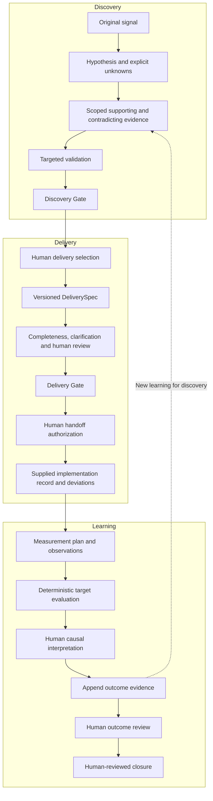
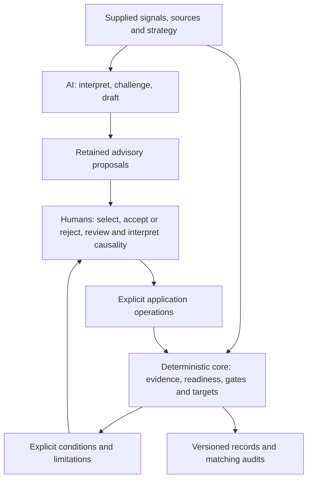
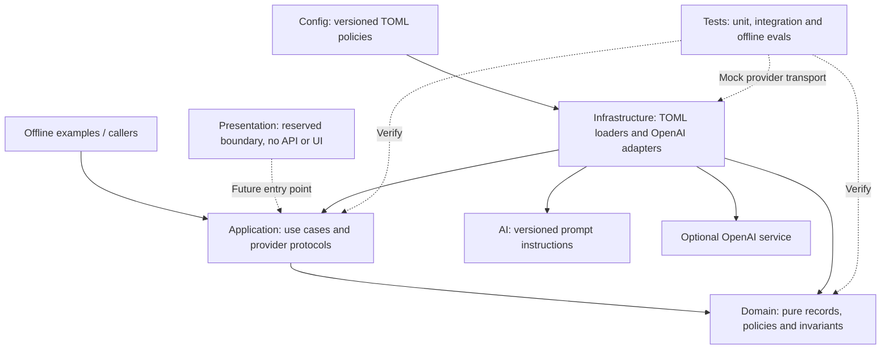

# Portfolio architecture

Three views of the implemented v0.1 system. For operational contracts, use the
[architecture overview](overview.md); for the product story, use the
[portfolio walkthrough](../portfolio-walkthrough.md).

## A. Full product lifecycle

This is a representative flow, not the exhaustive transition graph or strict ordering of
all review records. Evidence feedback informs the final review, and unresolved questions
can feed a distinct follow-up hypothesis. Gate pass permits a bounded next step; it neither
selects work nor executes implementation. Closed means a reviewed episode.

## B. Authority boundary

Humans supply semantic judgments and intent; code enforces valid operations under current
policy and supplied versions. Human accountability does not mean unrestricted bypass.
AI proposals cannot mutate authoritative records directly. See
[authority boundaries](authority-boundaries.md) for implemented override limits.

## C. Simplified system architecture

Arrows indicate dependency/use, rather than deployment services.

The domain imports no other architectural layer. Application services use provider
protocols; concrete adapters live in infrastructure and are supplied by callers. Prompt
modules contain interpretation instructions, while authoritative policy stays in code
and validated configuration. The presentation package is a placeholder. This architecture
is one Python modular monolith with no production storage or hosted service.
