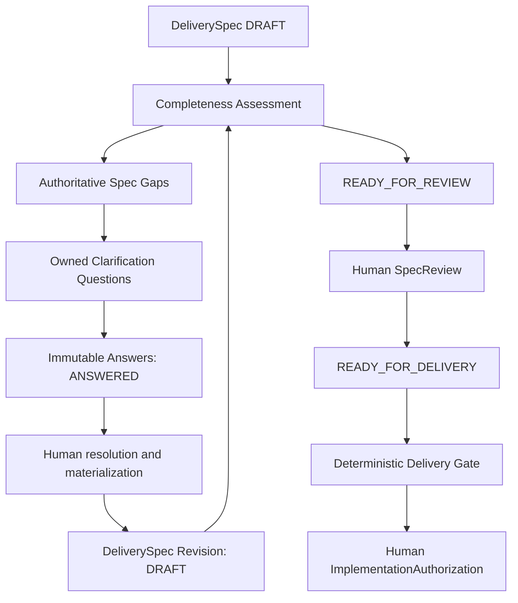

# Milestone 6: specification completeness, clarification and delivery entry

Milestone 6 ends at accountable implementation **handoff authorization**. It adds no
implementation record, execution, deployment, measurement or learning feedback. A selected
hypothesis remains `selected_for_delivery` throughout this milestone.

| Concept | Question | Authority |
| --- | --- | --- |
| Specification completeness | What information is sufficiently specified? | Versioned deterministic policy |
| Specification gap | What is missing, unknown, ambiguous, conflicting or unsupported? | Structural policy or explicit human review |
| Clarification | What must someone answer or decide? | Owned question and human answer/review |
| SpecReview | Has an accountable person reviewed this exact specification? | Explicit human disposition |
| READY_FOR_DELIVERY | Is this exact specification eligible for gate evaluation? | Controlled assessment/review transition |
| Delivery Gate | Are the configured delivery-entry conditions satisfied now? | Deterministic condition evaluation |
| ImplementationAuthorization | Has an accountable person authorized the handoff? | Separate explicit human action after PASS |

Every arrow is an explicit operation. Gate evaluation neither selects delivery work nor
recomputes Discovery Priority or portfolio prioritization. Discovery evidence and decisions
remain retained through the full Milestone 5 selection/context chain.

## Boundaries and retained records

| Module | Responsibility |
| --- | --- |
| `domain/spec_content.py` | Immutable material body, original provenance and version foundations |
| `domain/delivery_specification.py` | DeliverySpec workflow authority, material changes and historical snapshots |
| `domain/spec_completeness_policy.py` | Typed dimensions, applicability, minimum states, gap classes and gate conditions |
| `domain/spec_gaps.py` | Structural/human-reviewed gaps and consecutive immutable review history |
| `domain/spec_completeness.py` | Pure structural checks, deterministic gap detection and reconstructable assessments |
| `domain/spec_clarification.py` | Owned questions, immutable answers, actions, resolution and stale-version checks |
| `domain/spec_review.py` | Human review, status receipts and explicit superseded historical views |
| `domain/delivery_gate.py` | Recomputable gate conditions, expiry and separate human authorization |
| `application/spec_delivery.py` | Focused orchestration, IDs, explicit current-input checks and record construction |
| `infrastructure/configuration.py` | TOML I/O followed by domain policy validation |

The domain imports only domain modules, pure standard-library modules and Pydantic. The
material body is separate from workflow receipts to avoid circular assessment/specification
ownership and repeated status-dependent assessment inputs. Existing Milestone 5 imports and
operations remain available. A material revision resets workflow authority to DRAFT; it
never carries an obsolete review into a new version. Non-DRAFT DeliverySpec construction
requires reconstructable exact-body status receipts or supersession authority. Arbitrary
status edits and unchecked nested copies fail revalidation at supported service boundaries.

Retain all returned records: original specs and changes, contexts and source facts, gap
snapshots/reviews, assessments, full clarification/action transcripts, SpecReviews, status
snapshots, gates, authorizations and audits. References alone are insufficient history.

## Qualitative completeness and applicability

`config/spec-completeness.v1.toml` covers twenty explicit dimensions: intent, problem,
segment, outcome, scope, non-goals, conditional solution intent, functional requirements,
business rules, acceptance, quality, interfaces, data, analytics, dependencies, constraints,
risks, open questions, traceability and ownership.

Dimension states are UNKNOWN, INSUFFICIENT, PARTIAL, SUFFICIENT and NOT_APPLICABLE. Overall
states are INCOMPLETE, NEEDS_REVIEW and COMPLETE. There is no percentage, weighted average,
LLM score, probability or evidence-count bonus. Optional missing information remains visible
as a non-blocking gap. Required unknown/absent information prevents readiness. Accepted AI
wording remains a proposal and generally requires review or a grounded human decision;
acceptance does not relabel its epistemic origin.

The policy defines item types, required/optional treatment, minimum acceptable state,
applicability, default gap classification and targeted question/requested-information
wording for each dimension. Initial acceptance, traceability and ownership safeguards are
mandatory. Configuration rejects unknown/duplicate/missing dimensions or conditions,
unsafe minimums, contradictory required/non-blocking rules, invalid applicability,
unusable expiry and attempts to disable technical/accountable gate invariants.

Applicability is ALWAYS, SOLUTION_PRESENT or EXPLICIT_CONTEXT. No supplied solution intent
makes the solution dimension NOT_APPLICABLE; explicitly unknown intent stays UNKNOWN.
Conditional interfaces/data/quality/dependencies need an explicit human ApplicabilityDecision
linked to an actual supplied human ContextFact, retaining actor, time and rationale. Missing
declarations stay UNKNOWN. Explicit false declarations permit NOT_APPLICABLE. Code does
not infer external interfaces, privacy rules, performance thresholds, legal obligations or
owners from wording, product stereotypes or unstated assumptions. The human decision record
is an accountable assertion; the referenced fact is not machine proof of its semantic truth.

SUFFICIENT means the configured structural information and provenance are present. It is
not proof of semantic adequacy. A vague but explicitly human-decided requirement still
needs accountable semantic review. Structured criteria inspect every given/when/then clause;
unknown clauses cannot disappear behind a known criterion summary. COMPLETE can retain
non-blocking gaps, which the reviewer must explicitly cover.

Every assessment retains ID, exact full material spec/version, full policy/version,
applicability and semantic-gap inputs, actor/time, all dimension results, missing required
information, unresolved/blocking/non-blocking/review-required gaps, unknown conditions,
explanation and audit. Validators recompute results and structural gaps. `require_current`
compares complete material bodies and full policy snapshots, and checks validity rather
than trusting matching version labels alone.

## Explicit gaps and classification

SpecGap retains stable ID, exact spec/version, dimension, type, affected item IDs, statement,
rationale, source/basis, detected classification, current classification/status, detector,
time, optional owner, detection audit and immutable human review history. Types are MISSING,
AMBIGUOUS, CONFLICTING, UNSUPPORTED, UNRESOLVED_UNKNOWN and TRACEABILITY_GAP. Classifications
are BLOCKING, NON_BLOCKING and REVIEW_REQUIRED; unknown/invalid classifications are rejected.

Structural gaps come from policy checks. Missing acceptance, unknown required interface
information and absent traceability are deterministic concerns. Structural gap identities
bind spec/version, policy version, dimension and gap type; detection audits also bind time
and actor. They clear through actual revision/reassessment, not a human assertion that
missing content exists. Old assessment/gap snapshots remain unchanged.

Semantic ambiguity/conflict concerns need an explicit HUMAN materialization operation.
`review_gap` retains original and resulting classification/status, actor, time, reason,
resolution references and audit. Reviews must be consecutive; resolved/withdrawn gaps are
terminal snapshots. A reclassification cannot silently overwrite historical authority.
An assessment rejects unrelated, stale, unknown-item or unreviewed structural-as-semantic
inputs. Resolved semantic concerns remain in the assessment history.

AI gap/question generation is deliberately **not added** in this milestone. Milestone 5
AI drafting stays advisory and unchanged. There is no new provider, SDK adapter, prompt,
AI gap materialization, AI classification or paid evaluation. A future optional provider
must retain exact analyzed spec, structured proposals, provider/model/prompt metadata and
complete accepted/rejected human dispositions before materialization. It must never own
completeness, blocking classification, ownership, status, gates, resolution or handoff.

## Clarification lifecycle and answer materialization

Questions bind the exact assessment/spec version and an exact authoritative OPEN gap.
The classification is inherited from that gap. Policy templates target its specific missing
information: the search example requests the existing interface contract and its owner,
without inventing endpoints or thresholds. Every active blocking question requires an
explicit owner under v1; actors/teams are supplied, not inferred. Duplicate active/resolved
questions for the same gap are rejected when existing history is supplied.

The explicit lifecycle is OPEN → ANSWERED → RESOLVED, with WITHDRAWN available from OPEN or
ANSWERED. Owner reassignment preserves lifecycle state. Further adequate answers may be
recorded before resolution; every answer remains retained. Terminal questions cannot accept
new actions. Answers retain question ID, human actor/time, text, source references,
supporting artifacts, limitations and an explicit human-decision marker. Empty provenance,
coerced markers, cross-question references and inconsistent timestamps fail.

ANSWERED is not RESOLVED. An answer changes neither the gap nor the specification. Human
resolution explicitly consumes the latest answer and a current resulting assessment.
Material resolution retains the full DeliverySpecChange, requires the exact question
version as predecessor and v+1 as result, and checks that new context facts/items actually
materialize this answer's wording, source artifact and human-decision/system-fact origin.
Resolution references connect answer review to resulting fact/item IDs. Resulting information
must satisfy the dimension and leave no blocking/review-required concern there. Outstanding
answer limitations prevent resolution; record a new adequate answer instead.

A semantic interpretation may resolve without new material wording only when a new
assessment retains explicit human disposition of that same authoritative semantic gap.
Structural missing information cannot resolve through this path.

Questions never silently carry across revisions. `applies_to` compares exact bodies; an
unresolved old question is stale for v2. Resolution explicitly links it to its resulting
version. Explicit withdrawal retains the current version/body and rationale. Unrelated
spec/selection references fail. A later material revision conservatively requires fresh
resolution/withdrawal treatment; there is no automatic semantic relevance inference.

## Review and controlled status graph

| Source | Allowed operation targets |
| --- | --- |
| DRAFT | NEEDS_CLARIFICATION, READY_FOR_REVIEW |
| NEEDS_CLARIFICATION | DRAFT, READY_FOR_REVIEW |
| READY_FOR_REVIEW | DRAFT, NEEDS_CLARIFICATION, READY_FOR_DELIVERY |
| READY_FOR_DELIVERY | DRAFT, NEEDS_CLARIFICATION |
| SUPERSEDED | None |

NEEDS_CLARIFICATION consumes an exact assessment containing authoritative unresolved
blocking gaps. READY_FOR_REVIEW requires acceptable required information and no blocking
gaps. Services reject unresolved required clarifications supplied in the current history.
READY_FOR_REVIEW permits a human to assess semantic/advisory concerns; it is not a gate pass.

SpecReview retains ID, exact assessment/material spec, accountable reviewer/time, every
reviewed gap, disposition, rationale, concerns and audit. Dispositions are APPROVED,
CHANGES_REQUESTED and REVIEW_WITH_CONCERNS. Services require READY_FOR_REVIEW and current
exact input. All retained gaps, including non-blocking ones, must be covered. Approval is
never automatic; AI cannot act as accountable reviewer.

READY_FOR_DELIVERY requires COMPLETE assessment, no blocking/review-required gaps, required
information, exact APPROVED review without pending concerns, active policy, ownership and
valid timestamps. It only permits gate evaluation. Changes requested can return the same
material version to DRAFT with its retained review receipt. Material edits create a new
DRAFT version, preserving old readiness/review history in the previous snapshot.

`superseded(change)` produces an explicit SUPERSEDED historical view linked to the exact
consecutive material replacement and its supersession audit. It does not mutate the old
snapshot. Superseded views cannot be revised, reviewed into delivery, or gated successfully.

## Delivery Gate and authorization

DeliveryGateInput explicitly supplies the evaluated spec, caller's current spec, exact
selected hypothesis and DeliverySelection, latest completeness/review records and complete
clarification snapshots. Conditions cover ready status, exact current material identity,
selection linkage, completeness, approval, blocking gaps, clarifications, acceptance,
applicable interfaces/data/quality/dependencies, traceability, owner, full-policy agreement
and fresh records. These conditions are typed and configurable in TOML, not just hidden
orchestration logic. No Discovery Priority or portfolio decision is rerun.

Condition states are PASSED, FAILED, UNKNOWN and REVIEW_REQUIRED. Results are PASSED,
BLOCKED and NEEDS_REVIEW. Required unknown/failed conditions block ordinary PASS; review
conditions require review. Optional unknowns remain exposed. Gate results retain evaluated,
passed, failed, unknown and review-required conditions, blocking explanations, full inputs,
policy, evaluator/time, expiry and separate evaluation/outcome audits. Validators recompute
all conditions on construction/deserialization.

A new supplied semantic concern can block a previously READY_FOR_DELIVERY specification.
Obsolete/missing review and assessment references do not authorize a different body.
Initial validity is 24 hours from assessment; the gate cannot extend it. Authorization
rechecks the exact complete current input packet, full active policy, gate result and time.
New material versions, changed question state, mismatched selection/hypothesis, different
policy content, expired/future gates and non-PASS results fail. Callers must supply actual
latest records; there is no hidden latest-state lookup.

Overrides are intentionally **not supported**. Every handoff requires an ordinary PASS.
There is no permissive override flag or artificial override audit emitted without behavior.

ImplementationAuthorization is a separate human operation with its own ID, full gate,
exact current packet/policy, spec/version, hypothesis/selection references, authorizing
human, rationale, time, conditions and audit. It neither changes the hypothesis nor records
implementation completion. An accountable human must invoke it even when the gate passes.

## Audit and offline verification

Events cover completeness assessment; structural/human gap detection and review;
question creation, owner assignment, answer, resolution and withdrawal; NEEDS_CLARIFICATION,
READY_FOR_REVIEW and READY_FOR_DELIVERY; human SpecReview; supersession; Delivery Gate
evaluation/PASS/BLOCKED/NEEDS_REVIEW; and implementation handoff authorization. Receipts and
full immutable snapshots make important decisions reconstructable. Historical source and
review records remain retained. No override event is emitted because overrides are absent.

Run `env -u OPENAI_API_KEY -u DISCOVERY_ANALYSIS_MODEL RUN_LIVE_AI_EVALS=0 .venv/bin/python
examples/spec_delivery.py`. It demonstrates the requested selected hypothesis → DRAFT v1 →
blocking interface/non-blocking analytics gaps → owned answer → explicit resolution/v2 →
human review → READY_FOR_DELIVERY → gate PASS → separate handoff. v1 stays unchanged and
the hypothesis remains selected. Tests exercise configuration, applicability, provenance,
classification, resolution, stale records, controlled status, supersession, gate conditions,
handoff, tampering and the full example, alongside all Milestone 0–5 offline contracts.

No new AI capability means no new AI golden/live cases. The existing offline AI contracts
remain in normal pytest. All 18 existing live cases stay opt-in and intentionally deferred;
no paid call or live semantic verification is authorized here.

## Limits and architectural risks

- Structural presence/provenance checks cannot understand semantic adequacy, establish
  source truth, certify compliance or validate actual implementation feasibility. Human
  applicability, source classification and review quality remain accountable assertions.
- The application has no persistence, transaction, RBAC, signed actor identity, global
  ID registry or atomic latest-version comparison. Callers must retain records and supply
  complete latest gap/question/review state at transitions, gate evaluation and handoff.
  Omitted external changes cannot be discovered by pure snapshot models. Production
  hardening needs atomic persistence with a complete current-record packet, not reliance
  on a caller's old PASS. Expiry bounds time but cannot discover withheld state.
- Stable question/gap references need complete history; the service checks duplicate
  questions only against supplied existing records. A future repository must enforce
  uniqueness and reject concurrent branching atomically. State receipts cannot establish
  that an absent external question never existed.
- Full retained context and nested assessment/question/revision records can grow large.
  Future storage/redaction/retention policies must handle sensitive text and duplication.
- The v1 policy is explicit structural policy, not calibrated universal completeness.
  Static question templates are conservative; automatic semantic question customization,
  stale-question relevance analysis and schema/contract deep validation remain absent.
- Gate overrides and new AI advisory providers are deferred optional scope. Actual
  implementation records, deployment/completion, transition to `implemented`, outcomes,
  baseline/target/actual comparison, measurement windows, outcome evaluation, discovery
  learning feedback, measuring_outcome/closed execution and production persistence/UI
  remain Milestone 7 or final hardening work.
